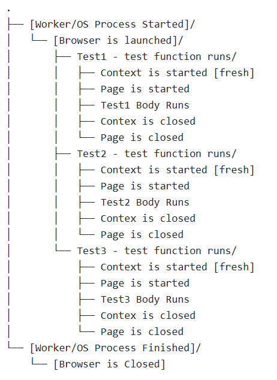
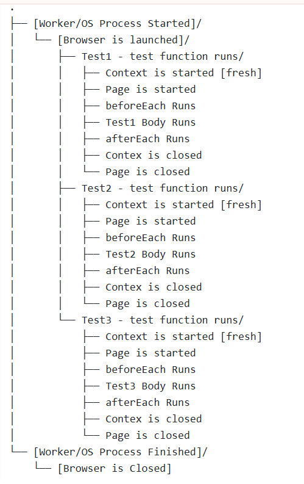
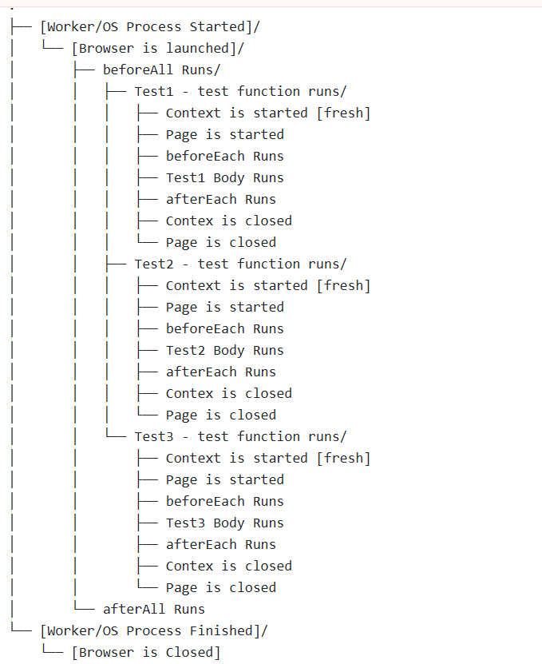

== Browser
A Browser is an instance of web browser (like Chromium, Firefox, or WebKit) that Playwright can control. It provides the environment in which you can create browser contexts and pages to interact with web applications.

In simple terms

Think of Playwright like how you use a real browser (like Chrome):

*** You open Chrome → that’s your Browser.
*** You open a new profile (different user login, separate cookies) → that’s a Context.
*** You open a new tab inside that profile → that’s a Page.

```javascript
const { chromium } = require('playwright');

(async () => {
  const browser = await chromium.launch();
  ** const context = await browser.newContext(); **
  const page = await context.newPage();
  await page.goto('https://example.com');
  await browser.close();
})();
```

💡 Analogy:
You double-click Chrome → Chrome app opens → that’s your browser.


== Context
A browser context in Playwright is an isolated environment within a browser instance. It allows you to create multiple independent sessions, each with its own cookies, local storage, and cache. This is particularly useful for testing scenarios where you need to simulate different users or sessions without interference.

When you create a new browser context, it behaves like a fresh browser profile. You can open multiple pages (tabs) within the same context, and they will share the same session data. However, different contexts do not share any data, ensuring that tests remain isolated from one another.

You can create a new browser context using the `browser.newContext()` method. This will give you a new context that you can use to launch pages.

A browser context is like an isolated browser session inside the browser.

Each context has its own:
** Cookies
** Local storage
** Cache
*** Authentication state
Tests running in different contexts cannot see each other’s data.

```javascript
const { chromium } = require('playwright');

(async () => {
  const browser = await chromium.launch();
  ** const context = await browser.newContext(); **
  const page = await context.newPage();
  await page.goto('https://example.com');
  await browser.close();
})();
```

💡 Analogy:
You open Chrome with Incognito mode — that’s a new context.
If you open another incognito window → that’s another context, totally separate.


== Page
A Page in Playwright represents a single tab or window within a browser context. It is the primary interface for interacting with web content, allowing you to navigate to URLs, interact with elements, and perform various actions on the web page.

You can create a new page within a browser context using the `context.newPage()` method. This will give you a new page that you can use to navigate to a URL and interact with the web content.


A page represents a single tab inside a context.

This is where you perform test actions:

** page.goto()
** page.click()
** page.fill()
** page.screenshot()

```javascript
const { chromium } = require('playwright');

(async () => {
  const browser = await chromium.launch();
  const context = await browser.newContext();
  ** const page = await context.newPage(); **
  await page.goto('https://example.com');
  await browser.close();
})();
```

💡 Analogy:
Inside your Chrome Incognito window, each tab you open is a page.

Visualization:

* Browser (Chrome instance)
 **  Context 1 (User A)
   *** Page 1 (Tab 1)
   ***  Page 2 (Tab 2)
 **  Context 2 (User B)
 *** Page 1 (Tab 1)
  *** Page 2 (Tab 2)


== PlayWright Test Life Cycle
Playwright tests typically follow a structured flow to ensure that each test is executed in a consistent manner. The general flow of a Playwright test includes the following steps:

[sidebar]
1. **Setup**: Initialize the Playwright environment, including launching a browser instance and creating a new page.
2. **Navigation**: Navigate to the target web application or page that you want to test.
3. **Interaction**: Perform actions on the web page, such as clicking buttons, filling out forms, and interacting with elements.
4. **Assertions**: Verify that the expected outcomes are achieved, such as checking for the presence of specific elements or validating the content of the page.
5. **Teardown**: Clean up the test environment by closing the browser instance and releasing any resources used during the test.

Lets look at a simple example of a Playwright test that follows this flow:


*🧩 Scenario (1) - Test file with no hooks*

This means you have one test file with multiple tests and no beforeEach or afterEach hooks. Below is an example of what happens under the hood when you run such a test file.

****
Given that you have one test file (e.g. example.spec.js) like this:

[source,js]
----
const { test } = require('@playwright/test');
test('test 1', async ({ page }) => { /* ... */ });
test('test 2', async ({ page }) => { /* ... */ });
test('test 3', async ({ page }) => { /* ... */ });

----

****
*⚙️ What happens under the hood*

* *Browser* fixture:

Created once per worker process (not per test).
If your test run uses 1 worker, a single browser instance (like Chromium) will be launched and shared by all tests in that worker.

* *Context* fixture:

Created fresh for each test.
Each test gets its own browser context, which is like an isolated browser profile (new cookies, local storage, etc.).
This ensures tests don’t interfere with each other.

* *Page* fixture:
Created fresh for each test.
Each test gets a new tab (page) inside its own context.


*Timeline of Browser, Context, Page Fixtures:*

Below is a summary of the lifecycle of the browser, context, and page fixtures during the test run.




* Worker starts
** Browser launched (1x)
    *** Test 1 → new context, new page → run → close context,close page
    *** Test 2 → new context, new page → run → close context,close page
    *** Test 3 → new context, new page → run → close context,close page
* Worker ends (tests done)
** Browser closed 


Below is a summary table of the lifecycle of the browser, context, and page fixtures during the test run.

****
[cols="1,1,1,1,1", options="header"]
|===
| Fixture     | Created When     | Reused?   | Count during run |Life Time
| **Browser**     | Once per worker   | ✅ Yes   | 1                | Till the end of all tests
| **Context**     | Before each test   | ❌ No    | 3 (one per test) | Till end of each test
| **Page**        | Before each test   | ❌ No    | 3 (one per test) | Till end of each test
|===
****

This lifecycle ensures that tests are isolated from each other while still being efficient by reusing the browser instance.

*Key takeaway*
💡 Even if you don’t use hooks, Playwright automatically ensures:
Each test = fresh browser context and page → No data leaks, no state carried over.


*🧩 Scenario (2) - Test file with beforeEach and afterEach hooks:*

This means you have one test file with multiple tests and with beforeEach/ afterEach hooks. Below is an example of what happens under the hood when you run such a test file.

****
You have two test files (e.g. example1.spec.js and example2.spec.js) like this:
[source,js]
----
test.beforeEach(async ({ page }) => {
  console.log('Setup before each test');
});

test('test 1', async ({ page }) => { /* ... */ });
test('test 2', async ({ page }) => { /* ... */ });
test('test 3', async ({ page }) => { /* ... */ });

test.afterEach(async ({ page }) => {
  console.log('Cleanup after each test');
});
----
****

*⚙️ What happens under the hood*

*Browser* fixture:
Create once per worker process (not per test).
If your test run uses 1 worker, a single browser instance (like Chromium) will be launched and shared by all tests in that worker.

*Context* fixture:
Create fresh for each test.
Each test gets its own browser context, which is like an isolated browser profile (new cookies, local storage, etc.).
This ensures tests don’t interfere with each other.

*Page* fixture:
Create fresh for each test.
Each test gets a new tab (page) inside its own context.

*Timeline of Browser, Context, Page Fixtures:*

Below is a summary of the lifecycle of the browser, context, and page fixtures during the test run.





** worker starts
 *** Browser → creates once
    **** Test 1 → new context, new page → beforeEach hook run → run → afterEach hook run → close context,close page
    **** Test 2 → new context, new page → beforeEach hook run → run → afterEach hook run → close context,close page
    **** Test 3 → new context, new page → beforeEach hook run → run → afterEach hook run → close context,close page
** worker ends (tests done)
  *** Browser closed

This lifecycle ensures that tests are isolated from each other while still being efficient by reusing the browser instance. The beforeEach and afterEach hooks allow you to set up and clean up resources needed for each test.

*Key takeaways:*
** Every test is isolated — it gets a fresh page and fresh browser context.
** Hooks (beforeEach and afterEach) run inside that same context.
** The browser is shared but context and page are not.
** Best choice when you want test isolation (recommended default).


*🧩 Scenario (3) - Test file with beforeAll and afterAll hooks:*

This means you have one test file with multiple tests and with beforeAll/ afterAll hooks. Below is an example of what happens under the hood when you run such a test file.


****
You have two test files (e.g. example1.spec.js and example2.spec.js) like this:
[source,js]
----
test.beforeAll(async ({ page }) => {
  console.log('Setup before all tests');
});

test('test 1', async ({ page }) => { /* ... */ });
test('test 2', async ({ page }) => { /* ... */ });
test('test 3', async ({ page }) => { /* ... */ });

test.afterAll(async ({ page }) => {
  console.log('Cleanup after all tests');
});
----
****

*⚙️ What happens under the hood*

*Browser* fixture:
Create once per worker process (not per test).
If your test run uses 1 worker, a single browser instance (like Chromium) will be launched and shared by all tests in that worker.

*Context* fixture:
Create fresh for each test.
Each test gets its own browser context, which is like an isolated browser profile (new cookies, local storage, etc.).
This ensures tests don’t interfere with each other.

*Page* fixture:
Create fresh for each test.
Each test gets a new tab (page) inside its own context.

*Timeline of Browser, Context, Page Fixtures:*

Below is a summary of the lifecycle of the browser, context, and page fixtures during the test run.





** worker starts
 *** Browser → creates once
  *** BeforeAll hook run
    **** Test 1 → new context, new page → test body run → close context,close page
    **** Test 2 → new context, new page → test bodyrun → close context,close page
    **** Test 3 → new context, new page → test body run → close context,close page
  *** afterAll hook run
** worker ends (tests done)
  *** Browser closed

This lifecycle ensures that tests are isolated from each other while still being efficient by reusing the browser instance. The beforeAll and afterAll hooks allow you to set up and clean up resources needed for test runs.

*beforeAll*,

•	This runs only once, before any test starts.
•	Important: The default Playwright fixtures (page, context) are not created yet, because they are per-test fixtures.
•	So, beforeAll runs in a slightly “fixture-less” mode — it only gets access to static fixtures like { browser } if you ask for them.

*afterAll*,
•	Runs only once, after all tests in the file finish.
•	Like beforeAll, it runs without per-test fixtures.
•	Usually used to clean up external data, servers, or test setup.


If you want to share one context or page across all tests, you must manually create them inside beforeAll using the browser fixture, like this:

****
[source,js]
----
let context;
let page;

test.beforeAll(async ({ browser }) => {
  context = await browser.newContext();
  page = await context.newPage();
  console.log('Setup once before all tests');
});

test('test 1', async () => {
  await page.goto('https://example.com');
});

test('test 2', async () => {
  await page.click('text=Next');
});

test.afterAll(async () => {
  console.log('Cleanup after all tests');
  await context.close();
});
----
****

🧩 In this case:
[Worker start]
 └─ Browser launched
     ├─ beforeAll (create context/page)
     ├─ Test 1 (uses same page)
     ├─ Test 2 (uses same page)
     └─ afterAll (close context/page)
[Worker end → Browser closed]

✅ Shared page & context across tests
⚠️ Not isolated — one test can affect another.


